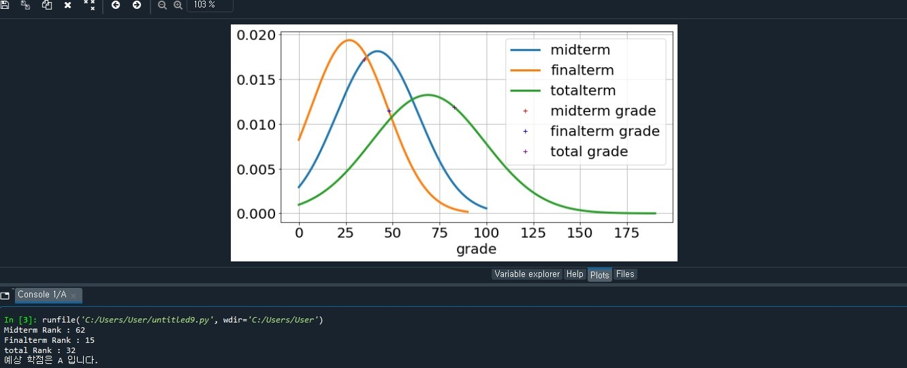

# predictGrade 

설계 목표 : 중간/기말 고사의 평균(mean), 표준편차(sigma), 인원수(population) 을 통해 자신의 등수, 최종 성적 계산

작동 방식
1) 주어진 중간/기말 고사의 평균과 표준편차를 이용하여 최종 성적에 사용될 평균, 표준편차를 구한다.
(평균=중간 평균+기말 평균 , 표준편차 = sqrt(중간 평균^2 + 기말 평균 ^2)

2) 중간/기말/최종 성적의 평균과 표준편차를 이용하여 정규분표포를 작성,출력한다.

3) 주어진 정규분표표를 표준화 시켜 해당 점수가 상위 몇%에 위치한 결과인지 계산한다.

4) 상위 %에 인원수를 곱해 중간/기말/최종의 등수를 구한다.

5) 주어진 범위에 따라 학점 A+~B를 부여한다. 

실행 예시 
mean1, sigma1 = 41.98, 22		# 중간고사 평균, 표준편차
mean2, sigma2 = 26.94, 20.59  	# 기말고사 평균, 표준편차
population = 100			# 시험 응시자 
grade1_x , grade2_x = 35,48		# 중간, 기말고사 성적 	

